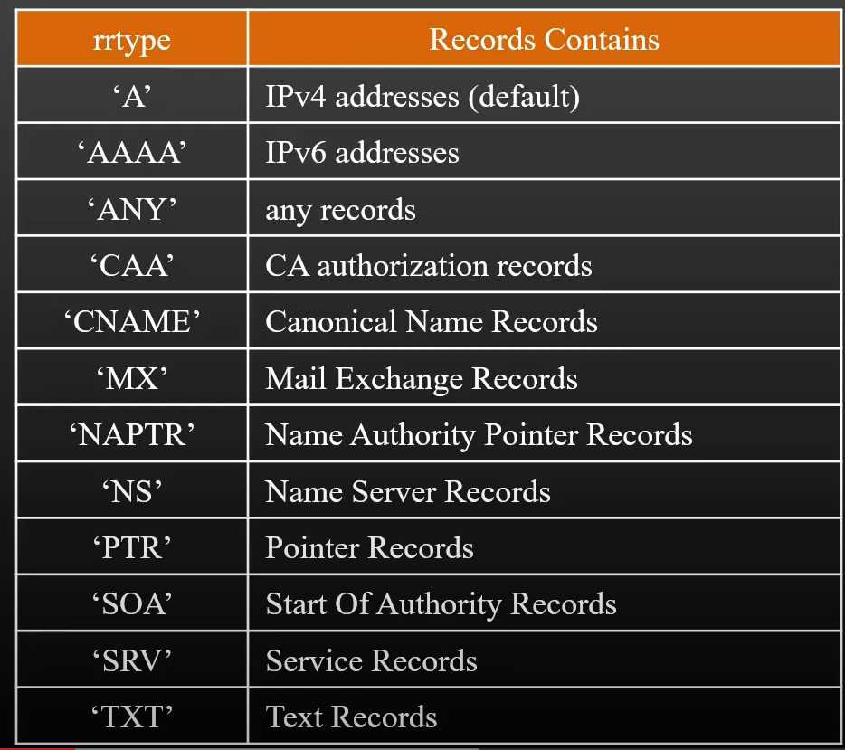

The dns(Domain Name System) module enables name resolution.
For Examples, use it to look up IP Address of host names.

import dns from "dns";

lookup() - It resoluves a hostname into the first found A(IPv4) or IPv6 record.
lookup() does not neccessarily have anything to do with the DNS protocol.
The implementation uses an operating system facility that can associate name with addresses,and vice-versa.

resolve() - It uses the DNS protocol to resolve a hostname into an array of the resource record.The callback function has argument.when successful,record will be an array of resouce recoud.

